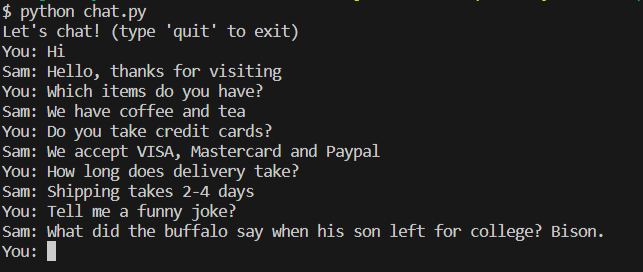

# Chatbot Application

This chatbot application is a powerful and versatile tool built using Python, Flask, PyTorch, torchvision, and Natural Language Toolkit (NLTK). It combines the strengths of these frameworks to create an intelligent conversational interface. Python provides a robust and flexible programming language, while Flask offers a lightweight web framework for building scalable applications.

PyTorch and torchvision form the backbone of the chatbot's natural language processing capabilities. These frameworks enable the implementation of state-of-the-art deep learning models for tasks like sentiment analysis, named entity recognition, and text classification. The chatbot leverages the power of PyTorch to train and fine-tune these models on large datasets, ensuring high accuracy and performance.

Additionally, the chatbot integrates NLTK, a popular library for natural language processing. NLTK provides a wide range of tools and resources for tasks like tokenization, stemming, and part-of-speech tagging. These features enhance the chatbot's understanding of user queries and enable it to generate more accurate and contextually relevant responses.

Overall, the combination of Python, Flask, PyTorch, torchvision, and NLTK empowers the chatbot application with advanced natural language processing capabilities, making it an invaluable tool for various use cases, such as customer support, information retrieval, and interactive conversation experiences.

## Views

<p align="center">
  
</p>

## Setup

- Clone the project: `git@github.com:rOluochKe/ai-chatbot-app.git`
- Change directory into : `cd /ai-chatbot-app`
- Create your environment and install dependencies: `pip install -r requirements.txt`
- Install nltk package
```
$ (venv) python
>>> import nltk
>>> nltk.download('punkt')
```
- Modify `intents.json` with different intents and responses for your Chatbot
- Run train: `python train.py` This will dump data.pth file. And then run
- Run app: `python chat.py`
